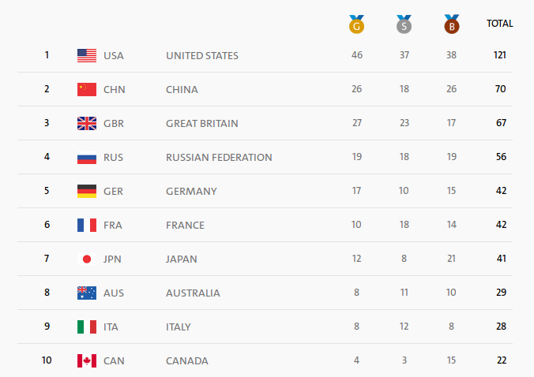
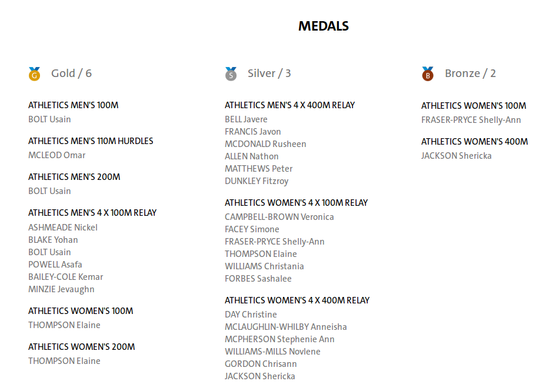

<style>
p.caption { font-style: italic; }
</style>

# Summary

In this web-scraping/visualization exercise we analyze recent Olympic games
in Rio and develop an interesting alternative view on the medal table. 

# Motivation

Looking at the official Rio 2016 Olympics Medal Table  we see team
USA confidently topping the charts.

But it is also easy to spot that they were also the most numerous team. Surely
bringing more people should give your team more shots at the medals, but how
strong is this link, and can we take into account varying --- ranging from 1 to
567 --- sizes of the delegations?



<!-- Which team was the most efficient in terms of medals per athlete? -->
<!-- To define a proper measure, we need to put several assumptions in place. -->

We will look at the total number of medals (not splitting into
gold/silver/bronze), and instead of 'official' counts we will consider the
number of actual medals given, i.e. if a team wins a medal, it is
counted as many times as there are people in the team.

So our measure of interest is `mpa` = `medals per athlete`, or its
reciprocal `athletes per medal`.

We can immediately notice that this approach favors team sports, but medals are
the same, whether you got it as a marathon champion or as a substitute on a
winning hockey team.

# Getting the data

```{r init, message = FALSE}
library(rvest)
library(data.table)
library(ggplot2)
```

The official website http://www.rio2016.com have a nice and clear structure,
that allows for straightforward web-scraping.
We need to check the source/inspect the pages to get appropriate CSS-selectors.

First we get the list of all participating countries with links to their
individual pages.

```{r}
links <- read_html("https://www.rio2016.com/en/countries") %>% 
    html_nodes(".table-ordenation__col--country-name") %>% 
    html_attr("data-href")
```

Now we need to scrape all useful information from the individual country pages,
such as https://www.rio2016.com/en/jamaica.
Conveniently these pages provide information on athlete-medals that we need, as
all members of a team medals are listed.



With a bit of page inspection we come up with the following function: 

```{r}
## extract all relevant numbers
getInfo <- function(link) {
  html <- read_html(paste0("https://www.rio2016.com", link))
  
  list(
      country     = html_text(html_node(html, "div.page-info__highlights h1.page-info__title--countrie")),
      abbr        = html_text(html_node(html, "a.page-info__country-link"), trim  = TRUE), 
      athletes    = length(html_nodes(html, "ul.athletes-teams-graphic__full-list-content-list li")),
      medals      = length(html_nodes(html, "a.medals-list__item-link")),
      gold        = length(html_nodes(html, "li.medals-list__item:nth-of-type(1) a.medals-list__item-link")),
      silver      = length(html_nodes(html, "li.medals-list__item:nth-of-type(2) a.medals-list__item-link")),
      bronze      = length(html_nodes(html, "li.medals-list__item:nth-of-type(3) a.medals-list__item-link")),
      athmed      = length(html_nodes(html, "span.medals-list__item-athlet")),    # N athlete-medals
      athgold     = length(html_nodes(html, "li.medals-list__item:nth-of-type(1) span.medals-list__item-athlet")),
      athsilver   = length(html_nodes(html, "li.medals-list__item:nth-of-type(2) span.medals-list__item-athlet")),
      athbronze   = length(html_nodes(html, "li.medals-list__item:nth-of-type(3) span.medals-list__item-athlet"))
  )
}
```
It will get official medal counts, together with actual medal counts (or athlete-medals) that we will use. 

Now we can apply it on our list of country links and bind all into a data table.

```{r cache = TRUE}
fullList <- lapply(links, getInfo) # NB: this will take some time and needs internet access
fullDT <- rbindlist(fullList)
```

# Results

Now the data is ready, and we can start our exploration.

Totals for each column are:
```{r}
knitr::kable(sumsDT <- fullDT[, lapply(.SD, sum), .SDcols = -c(1:2)])
```

It means that average `mpa` is
`r sprintf("%.d/%.d = %.2f", sumsDT$athmed, sumsDT$athletes, sumsDT$athmed/sumsDT$athletes)`, meaning that on average
every `r sprintf("%.2f", sumsDT$athletes/sumsDT$athmed)`-th athlete got a
medal.

<!-- *Note that athletes that have several medals are counted several times. This -->
<!-- means that our measure is 'average number of medals per athlete' have also -->
<!-- considered 'athletes with medals', i.e. c* -->

We keep only countries with at least one medal, and compute our metrics of
interest:

```{r}
medalDT <- fullDT[medals>0]
medalDT[, `:=`(mpa = athmed/athletes, gpa = athgold/athletes, 
        spa = athsilver/athletes, bpa = athbronze/athletes,
        `ath/med`= athletes/athmed)]
```

Now plot the `mpa`:
 
```{r fig.height = 10, fig.width = 7, warning = FALSE}
ggplot(medalDT[order(-mpa)], aes(y = 1:nrow(medalDT), x = mpa)) + scale_y_reverse(expand = c(0, 1)) + 
    geom_point(size = 1) +
    geom_segment(aes(xend = 0, yend = 1:nrow(medalDT))) + 
    geom_text(aes(label = country, x=-0.15, hjust=0.5), size = 2) +
    
    geom_point(aes(x = -0.3-medals/200), size = 1, color = "grey") +
    geom_segment(aes(xend = -0.3, x = -0.3-medals/200, yend = 1:nrow(medalDT)), color = "grey") +   
   
    geom_point(size = 1, aes(x = ifelse(gpa == 0, NA, gpa)), color = "gold") + 
    geom_segment(aes(xend = 0, x = gpa, yend = 1:nrow(medalDT)), color = "gold") +
    
    ggtitle("Olympic teams efficiency\n medals per athlete (right panel) and total medals (left panel)") + 
    scale_x_continuous(breaks = c(-9:-3, 0:6)/10, labels = c(20*6:0, (0:6)/10),  
        limits = c(-0.95, 0.6)) + theme_minimal() +
    theme(
        axis.title = element_blank(), axis.line.y = element_blank(), axis.text.y = element_blank(),
        axis.ticks.y = element_blank(), panel.grid.major.y = element_blank(),
        panel.grid.minor = element_blank(),
        axis.text.x = element_text(margin = margin(0))
    )
```

We see that leaders have changed now, namely Jamaica and Serbia were the
most 'efficient' in medal accumulation. Every second athlete from these two
countries got a medal.

We can also check how the rankings change for all countries *(note that
gold/silver/bronze counts are taken to resolve ties as in the official
ranking)*:

```{r warning = FALSE, fig.height = 10, fig.width = 7}
rankDT <- medalDT[medals>0, .(country, abbr, 
        medalrank = frankv(medals, order = -1, ties.method = "min"),
        medalrank2 = frankv(.(medals, gold, silver, bronze), order = -1, ties.method = "min"),
        phmedrank = frankv(athmed, order = -1, ties.method = "min"),
        mparank = frankv(mpa, order = -1, ties.method = "min"),
        mparank2 = frankv(.(mpa, gpa, spa, bpa), order = -1, ties.method = "min")
    )]

rankDT[, `ranking change` := medalrank2-mparank]

long <- melt(rankDT, variable.factor = FALSE, id.vars = c("country", "abbr", "ranking change"))

ggplot(data = long[variable %in% c("medalrank2", "mparank2")], 
        aes(x = variable, y = value, group = abbr, color = `ranking change`)) + 
    geom_line() +
    geom_text(data = long[variable == "mparank2"][order(value)], 
        aes(x = 2.01, y = value+unlist(lapply(rle(value)$length, function(x) 1:x))-1, label = value, hjust = 0), size = 2, check_overlap = TRUE) +
    geom_text(data = long[variable == "medalrank2"], 
        aes(x = 0.99, label = value, hjust = 1), size = 2, check_overlap = TRUE) +
    
    geom_text(data = long[variable == "mparank2"][order(value)], 
        aes(x = 2.1, 
            y = value+unlist(lapply(rle(value)$length, function(x) 1:x))-1, 
            label = country, hjust = 0), size = 2) +
    scale_color_gradient2(low = "darkred", mid = "darkgray", high = "darkgreen", name = "ranking change\n",
        breaks = c(0, range(long$`ranking change`)),
        labels = c(0, paste0(ifelse(range(long$`ranking change`)>0, "+", ""), range(long$`ranking change`)))) + 
    scale_y_reverse(breaks = 1:nrow(rankDT)) + theme_minimal() +
    scale_x_discrete(labels = c("official medal rank", "'effectiveness' rank")) +
    ggtitle("Changes in medal rankings from official to 'effectiveness' view") +
    theme(
        axis.title = element_blank(), 
        axis.line = element_blank(), 
        axis.text.y = element_blank(),
        axis.ticks.y = element_blank(), 
        panel.grid.major = element_blank(),
        panel.grid.minor = element_blank(),
        axis.text.x = element_text(margin = margin(-30))
    )
```

```{r ideas, echo = FALSE}
# TODO: try to plot highest deviations from 'mean' 
# plot(residuals(lm(athmed~athletes, medalDT[order(-mpa)])),type='h')

# TODO: try fonts

# TODO: improve theme

# TODO: add county in the middle & width of lines prop to the number of teams there

#plotly::ggplotly()

# TODO: interactive dotchart with buttons to (smoothly) switch display ath/med
# dotchart with tabs: ath/med | ath/med_p | ath/med1 | med
# hover: number
# ? color by continent
# ? size by # medals/ athletes
## TODO: Rmd/rnotebook/ipynb document

## TODO: ?add screenshots
#webshot::webshot("https://www.rio2016.com/en/russian-federation", vwidth = 1600, 
#    selector = "div#medals", delay = 5)
```


